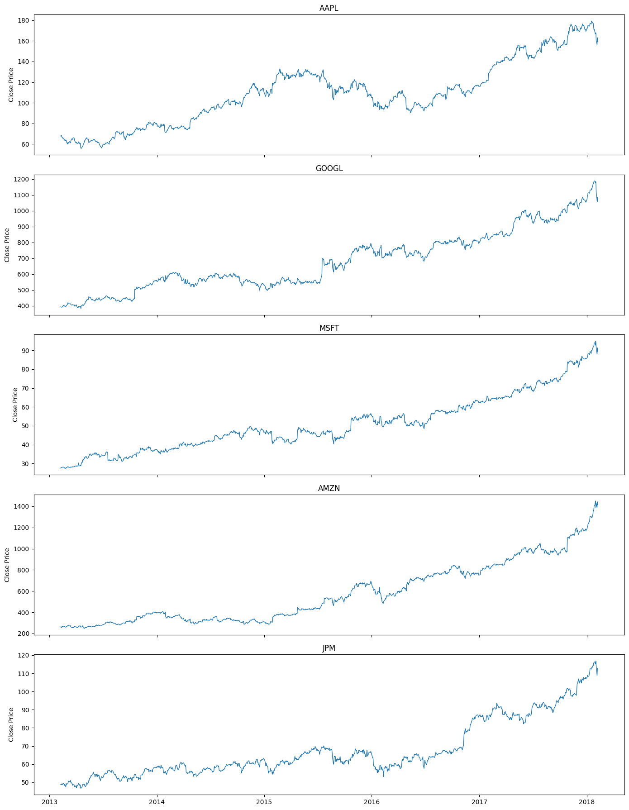

# Stock Trend Classifier — S&P 500 Deep Learning

> *"Spent weeks trying to break 60% ROC-AUC. Tried everything — LSTM, GRU, pos_weight, undersampling, hyperparameter tuning, threshold sweeps. Turns out, the market had already priced it in."*

**Author:** Gautam Kumar Kanojia &nbsp;|&nbsp; [](https://github.com/gautam-kumar-7590) &nbsp;[](https://linkedin.com/in/GautamKumarKanojia)

    

---
.png)

## Project Overview

Built a binary stock trend classifier on 505 S&P 500 companies (~630K rows, Feb 2013 – Feb 2018) using PyTorch LSTM and GRU architectures. The model predicts whether a stock's closing price will be higher 5 days from now using 17 engineered features derived from raw OHLCV data. Trained on Google Colab T4 GPU, iterated extensively, and migrated final evaluation to VS Code.

The project went through 8 model variants, multiple bug fixes, hyperparameter tuning with per-epoch threshold sweeps, and class imbalance experiments — before concluding that the ~51–52% ROC-AUC ceiling is not a pipeline failure, but a signal-to-noise reality consistent with the Efficient Market Hypothesis.

---

## Business Problem

Can a deep learning model extract consistent directional signal from raw OHLCV data and technical indicators to predict 5-day price movement across 505 stocks?

**Spoiler:** Barely — and understanding *why* is the actual result.

---

## Dataset

| Attribute | Detail |
|---|---|
| Source | [Kaggle — camnugent/sandp500](https://www.kaggle.com/datasets/camnugent/sandp500) |
| Companies | 505 S&P 500 tickers |
| Total Rows | ~630,000 |
| Rows per Company | ~1,259 (consistent across all tickers) |
| Date Range | February 2013 – February 2018 |
| Raw Features | 7 (date, open, high, low, close, volume, ticker name) |
| Engineered Features | 17 |
| Target | Binary — 1 if close[t+5] > close[t], else 0 |

### EDA Visualizations

**Close Price Trends — AAPL, GOOGL, MSFT, AMZN, JPM (2013–2018)**



**Row Count per Company**


**Volume Distribution (Log Scale)**


---

## Tech Stack

| Tool | Purpose |
|---|---|
| Python 3.x | Core language |
| PyTorch | LSTM / GRU model building and training |
| Pandas / NumPy | Data manipulation and feature engineering |
| Scikit-learn | Preprocessing, metrics (ROC-AUC, F1, confusion matrix) |
| Matplotlib / Seaborn | EDA and confusion matrix visualization |
| Joblib | Saving scaler and threshold |
| Google Colab T4 GPU | Model training |
| VS Code | Final evaluation and inference |
| Power BI | Interactive dashboard |

---

## Preprocessing

- Converted `date` column from `object` → `datetime64`
- Engineered 17 features: MA7, MA21, RSI, MACD, BB_upper, BB_lower, momentum, ROC, volatility, gap, vol_momentum, ticker_id, open, high, low, close, volume
- Target evolution: 1-day return % → 5-day forward return → binary ±2% threshold → final simple binary (close[t+5] > close[t])
- Chronological 80/20 train/test split by date (~2017 cutoff — no data leakage)
- Applied `StandardScaler` on features only (fit on train, transform on both)
- Built per-ticker sliding window sequences (SEQ_LEN = 30) using a dedicated `create_sequences` function
- Final training shape: `X_train ~ (19K, 30, 17)`

---

## Models Compared

| Model | ROC-AUC | Accuracy | Notes |
|---|---|---|---|
| LSTM — Regression, 1-day target | ~0.50 | — | Random, no signal |
| GRU — Regression, 1-day target | ~0.50 | — | Same result |
| LSTM — Regression, 5-day target | ~0.53 | — | Slight signal, plateaued |
| GRU + ReLU + BatchNorm | — | 58.9% | Collapsed to predicting all Up |
| Classification + BCELoss | — | 59.17% | Still predicting all Up |
| Classification + pos_weight | — | — | Class imbalance unresolved |
| Classification + Undersampling | ~0.48 | — | Worse than random, corrupted temporal order |
| **Final GRU — Threshold tuned** | **0.5174** | **53%** | **Best result — balanced predictions** |

---

## Challenges

| Challenge | What Happened | Resolution |
|---|---|---|
| The 56–59% ceiling | Every architecture change, every trick — same ceiling. Spent weeks thinking the pipeline was wrong. | Eventually confirmed this is the theoretical limit for raw OHLCV + technical indicators on liquid markets. EMH. Not a bug. |
| Models predicting all Up | pos_weight, undersampling, BCELoss — all resulted in class collapse or temporal corruption | Removed undersampling from test set, tuned threshold inside training loop |
| `fillna(method='ffill')` deprecation | pandas FutureWarning breaking the notebook | Replaced with `.ffill()` |
| `clip_val` on binary target | Meaningless clipping applied to 0/1 labels | Deleted entirely |
| `SEQ_LEN` used before definition | NameError at runtime | Moved to top of preprocessing block |
| Duplicate StandardScaler block | Fitting scaler twice, second overwriting first | Deleted first block |
| Manual sequences loop mixing tickers | Sequences were crossing ticker boundaries silently | Deleted manual loop, kept only `create_sequences` with per-ticker logic |
| GRU criterion/optimizer pointing at LSTM | Wrong model being trained silently | Fixed — `model_gru` instantiated before all training code |
| `joblib` not imported | NameError when saving threshold | Added `import joblib` |
| `sample_size` not defined | NameError in inference cell | Added `sample_size = 5` |
| CSV FileNotFoundError on Colab | Local path not found in Colab environment | Fixed with `files.upload()` |

---

## Final Model Performance

**GRU — Final Results (Threshold: 0.50)**

| Metric | Score |
|---|---|
| ROC-AUC | 0.5174 |
| Accuracy | 53% |
| Macro F1 | 0.52 |
| Best Threshold | 0.50 (swept per epoch) |

.png)

**Classification Report**

| Class | Precision | Recall | F1 |
|---|---|---|---|
| Down | 0.44 | 0.42 | 0.43 |
| Up | 0.60 | 0.61 | 0.61 |
| Macro Avg | 0.52 | 0.52 | 0.52 |

**Confusion Matrix**


---

## Power BI Dashboard

Interactive dashboard showing model KPIs, close price trends by ticker (2013–2018), trading volume by quarter, and MA7 vs MA21 moving average trend.

.png)

---

## Key Insights

- **EMH in action:** Raw OHLCV + standard technical indicators carry weak forward-looking signal on liquid large-cap stocks. A ROC-AUC of ~0.52 is not a failure — it's the expected result and confirms market efficiency.
- **Architecture doesn't fix signal:** Switching LSTM → GRU, adding BatchNorm, ReLU, dropout — none of it moved the ceiling. The bottleneck was data informativeness, not model capacity.
- **Threshold tuning matters more than architecture:** Per-epoch threshold sweep (tracked best Macro F1 across thresholds) was the single most effective intervention. Prevented class collapse that plagued earlier variants.
- **What would actually help:** Sentiment data (news, earnings call transcripts), order flow / Level 2 data, alternative data (satellite, web traffic), or cross-asset signals — anything outside the OHLCV feature space.

---

## Deliverables

| File | Description |
|---|---|
| `Stock Trend Project.ipynb` | Full notebook — EDA, feature engineering, all model variants, evaluation |
| `best_gru_model.pt` | Saved GRU model weights |
| `best_lstm_model.pt` | Saved LSTM model weights |
| `scaler.pkl` | Fitted StandardScaler |
| `final_tuned_threshold.pkl` | Best threshold from per-epoch sweep |
| `Stock Trend Classifier DASHBOARD.pbix` | Power BI dashboard |
| `Confusion Matrix GRU model.png` | Final model confusion matrix |
| `plot.png` | Close price EDA — 5 major tickers |
| `Row Count per Company.png` | Dataset consistency visualization |
| `Volume Distribution.png` | Volume distribution (log scale) |

---

## How to Run

```bash
# 1. Install dependencies
pip install torch pandas numpy scikit-learn matplotlib seaborn joblib

# 2. Place the dataset in the project folder
# Dataset: Stock Trend Project Dataset.csv
# Source: https://www.kaggle.com/datasets/camnugent/sandp500

# 3. Run the notebook
# Open Stock Trend Project.ipynb in VS Code or Jupyter
# Run all cells in order

# 4. Load the saved model for inference
import torch, joblib
model = GRUModel(...)  # define architecture first
model.load_state_dict(torch.load('best_gru_model.pt'))
threshold = joblib.load('final_tuned_threshold.pkl')
```

> **Note:** Heavy training cells were originally run on Google Colab T4 GPU. For local inference only, CPU is sufficient.

---

<p align="center">
  Made with PyTorch, patience, and a healthy respect for the Efficient Market Hypothesis<br>
  <a href="https://github.com/gautam-kumar-7590">GitHub</a> &nbsp;|&nbsp;
  <a href="https://linkedin.com/in/GautamKumarKanojia">LinkedIn</a> &nbsp;|&nbsp;
  progautam54@gmail.com
</p>
